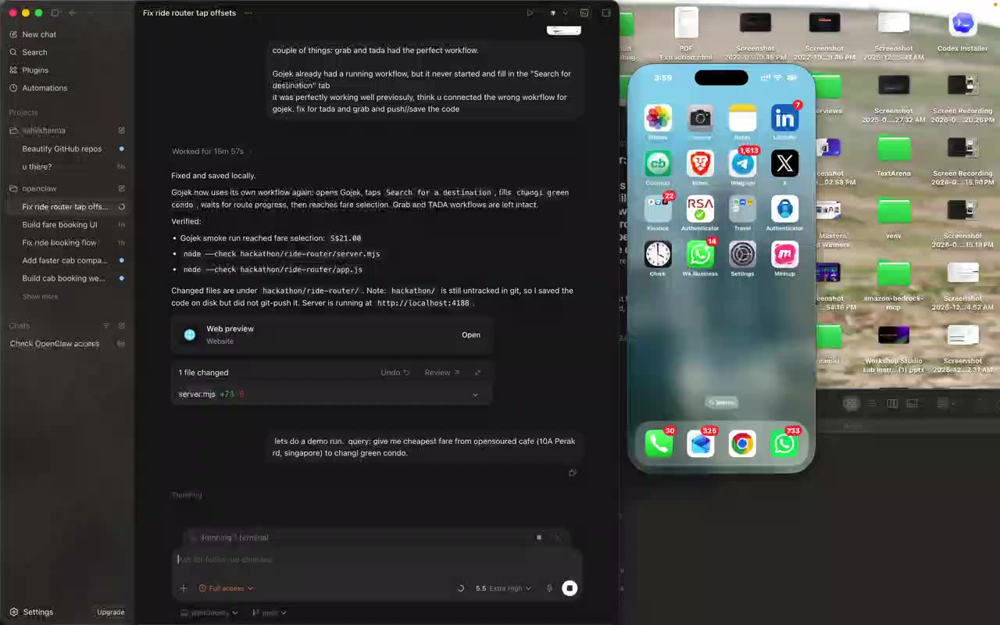

# Ride Router

Mobile-first cab comparison prototype for Singapore ride apps.

## Demo

[](assets/demo.mp4)

Click the preview to watch a demo run for the query: `give me cheapest fare from opensoured cafe (10A Perak rd, singapore) to changi green condo.`

## Run

```sh
node hackathon/ride-router/server.mjs
```

Open the LAN URL printed by the server from your iPhone.

Location access on iPhone Safari requires a secure origin. If the phone blocks GPS on the local `http://` URL, use the manual pickup field or put the server behind an HTTPS tunnel.

## What Works

- Detects current location when the browser permits it.
- Resolves destination text with OpenStreetMap Nominatim.
- Estimates distance and fare bands for Grab, Gojek, CDG Zig, and TADA.
- Lets you confirm real observed fares after opening each app.
- Picks the cheapest confirmed fare, or the cheapest estimate if none are confirmed.
- Copies the destination before opening a ride app so booking is faster.
- Starts iPhone Mirroring fare checks as a background job, then polls partial OCR results while the Mac keeps moving through apps.
- Uses the fixed Travel folder layout directly and taps known Grab/CDG/TADA prep points to avoid slow folder OCR and common ad blockers.
- Accepts a command like `give me cheapest fare from opensoured cafe (10A Perak rd, singapore) to changi green condo.` and prints only Grab, Gojek, and TADA fare lines.
- Accepts `book grab`, `book gojek`, or `book tada`, asks for one browser confirmation, then taps the recognized final booking action in iPhone Mirroring after preparing the trip.

## Pitch Notes

Open `ppt-points.html` for slide-ready copy on the speed strategy, iOS foregrounding limits, and OCR challenges from app ads.

## Limit

Ride apps do not expose a stable public web API for booking from a third-party page. Booking uses local iPhone Mirroring automation and only taps a final action when the requested provider's booking button is visible.
